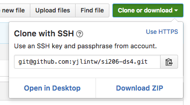

# Instruction
## Git / Github Instruction
1. Forked this repo to your account
2. Under the repo you just forked, which you should see 
<your_user_name>/<repo_name> at the title, clone that repo 
to your local machine
    1. You can find the URL here, use **Clone with SSH**  
       
    2. In the terminal window, switch to a folder that you 
    would like to clone the repo to.  
        Hint: use ```cd``` to switch to different directory  
        Hint: use ```ls``` to list all the non-hidden files 
        under current directory
    3. Use ```git clone <url>``` to clone the repo.  
    Double check that your URL is similar
    to ```git@github.com:<your_username>/<repo_name>.git```
3. Type ```ls``` to make sure that the repo is correctly
    clone to your disk, you should see a folder whose name is
    the repo's name
4. Now you can switch to the folder and work on the 
    assignment

### Git Cheatsheet
1. Check the local repo status: ```git status```
2. Stage the change for commit: ```git add <path/to/the/file>```
3. Commit the staged files: ```git commit -m <message>```
4. Push your change to a remote server: 
```git push origin master```

## Assignment Instruction
1. You will need to use python to read a dataset (plaintext 
file), grab specified information by using regular expression, 
and store it to a specified variables
2. The dataset locates in the folder ```data/```.  
**!!!Please don't move the file outside the folder!!!**  
**!!!Please don't move the .py file to the data folder, either !!!**
3. In the ```.py``` file you can add lines to help you debug or 
test (not unittest) your code. But you would only need to edit 
strings which assigns to the first parameters of ```open()``` 
method and assigns to the variable ```regex``` to complete the 
tasks.
4. I have written the unittest test case at the bottom of the
code. You can use that to check whether your code fulfills the
requirements or not.

 

